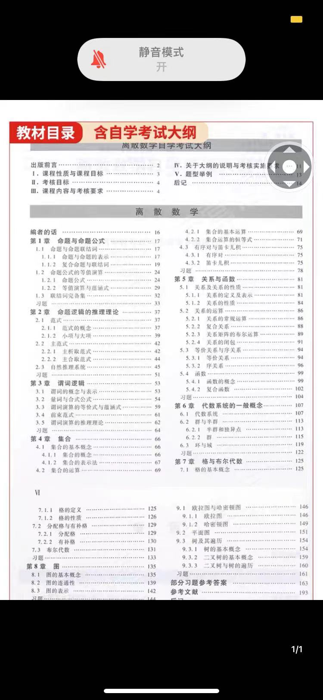
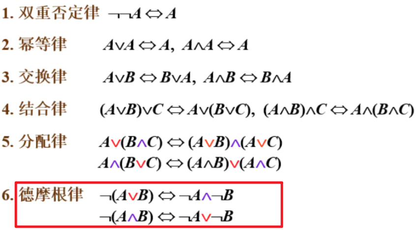
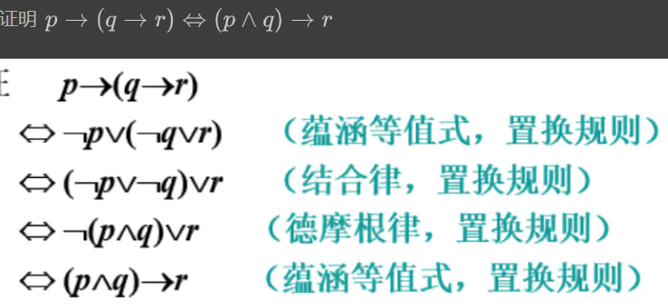
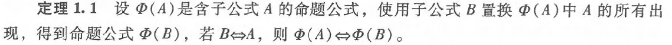
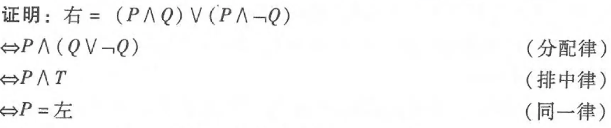

[离散数学系列文章汇总](https://memcpy0.blog.csdn.net/article/details/119997004?spm=1001.2014.3001.5502)

#### 逻辑等价式和重言蕴含式

[逻辑等价式和重言蕴含式](https://memcpy0.blog.csdn.net/article/details/120175933)

#### A命题符号化及联结词

##### 命题简介

- 命题：能判断真假的陈述句。
- 真值：一个命题总具有一个值，即真（用 1 或 T 表示）或假（用 0 或 F 表示）。
- 一切没有判断内容的句子，无所谓是非的句子，如感叹句、疑问句、祈使句等都不是命题。
- 判断一个句子是否是命题的关键：是否是陈述句；真值是否唯一
- 简单命题（原子命题）：不能分解为更简单的陈述句。
- 复合命题：由联结词、标点符号把几个原子命题联结起来的命题。

##### 命题的表示

- 使用小写英文字母p，q，r...或带下标的小写字母pi，qi，ri...或用数字如[12]表示。
- 命题标识符：表示命题的符号。如p，Ai，[12]等。
- 命题符号化：将命题的符号放在该命题的前面。
- 命题常量：真值确定的简单命题

##### 联结词

- 联结词，也称真值联结词或逻辑联结词或逻辑运算符

- 假设p，q为两个命题，常用的5个联结词有

  1. 否定┐

     ​    **定义1.1 ：**设p为一个命题， p的否定是一个新命题，记作┐p。自然语言常用联结词：“不”，“无”，“没有”，“并非”等

  2. 合取∧ 

        **定义1.2 ：**两个命题p和q的合取是一个复合命题，记作p∧q。自然语言中常用的联结词： “且”，“既…又...”，“不仅…而且…”，“虽然···但是”，“…和…”等

  3. 析取∨

     ​    **定义1.3 ：** 两个命题p和q的析取是一个复合命题，记作pVq。自然语言中常用联结词：“可兼或”，有些或不是联结词。

  4. 蕴涵（条件）→

     **定义1.4 ：**
     设 P、Q是命题 , P 对于 Q 的条件命题记作 P → Q。当且仅当 P 的真值为 1 且 Q 的真值为 0 时 , P → Q 的真值才为 0;其他情况 , P → Q 的真值都为 1 

     给定两个命题p和q， 其条件命题是一个复合命题。 记作p→q， 读作 “如果p，那么q”或 ‘若p则q” ，称p为前件，q为后件。
  5. 等价
     给定两个命题p和q， 其等价命题是一个复合命题，记作 P<->q，读作 “p当且仅当q。自然语言： 当且仅当。
     当 P 和 Q 的真值相同时 , P<->Q 的真值为 1;当 P 和 Q 的真值不相同时 , P<->Q 的真值为 0。

#### A命题公式及分类

##### 命题公式相关术语

重言式

若命题公式G在它的所有解释下均为真，则称G为重言式（tautology），或称G是永真的.
...

#### A等值演算

##### 两个命题公式等值：

两个命题公式A，B，如果在其任何解释I下，相应的真值均相同，则称A与B等值（equivalent），记为A⇔B.

##### 等值演算的概念

根据已知的等值式推演出另外一些等值式的过程称为等值演算。

等值式定律是接下来等值演算的基础。

*例*

*例*

等值演算例题：

#### A蕴涵式

几个常见的推理定律：

##### 几个基础的蕴涵式结论：

拒取式：

是在蕴含表达式中，否定后件，得出否定前件的结论。

析取三段式：

(A∨B) 是正确的 , 其中 B 是错误的 , 那么 A 肯定是正确的 (或者A或者B，并非B那么A。)

假言三段论：

...

