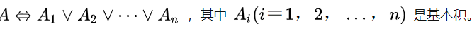
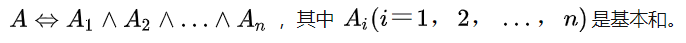
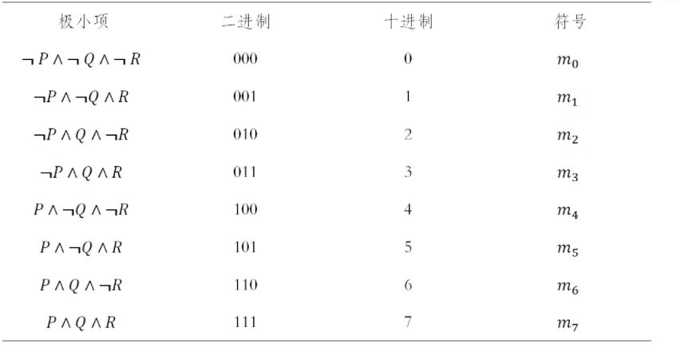
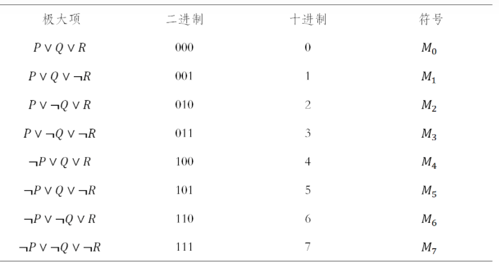

#### 范式

##### 范式的概念

文字的概念

...

简单析取式

简单合取式

为叙述方便，我们把合取称为积，把析取称为和。

##### 基本积（简单合取式）

命题公式中的变元及其否定的合取

##### 基本和（简单析取式）

命题公式中的变元及其否定的析取

##### 析取范式

##### 合取范式

#### 主范式

##### 主析取范式

**极小项的概念:**

在含 [n] 个变元的基本积中，若每个变元与其否定不同时存在，而二者选其一且仅出现一次，则称这种基本积为极小项。

**主析取范式：**

一个由极小项的**和**组成的公式，如果与命题公式 [A] 等价，则称它是公式 [A] 的主析取范式，其形式唯一。

##### 主合取范式

**极大项及概念：**

在含 [n] 个变元的基本和中，若每个变元及其否定不同时存在，而二者选其一且仅出现一次，则称这种基本和为极大项。 [n] 个变元可构成 [2的n次方] 个不同的极大项。

**主合取范式：**

一个由极大项的积组成的公式，如果与命题公式 [A] 等价，则称它是公式 [A] 的主析合范式，其形式唯一。

##### 主范式的四种表示方式

