#### 谓词逻辑

##### 谓词的概念

- 个体常项
  - a，b，c

- 个体变项
  - x，y，z

个体域（论域）

谓词常用大写英文字母P\Q\R来表示。

- 谓词变项（命题函数）
  - 元数
  - 0元谓词（不带个体变项）

##### 量词与合式公式

- 量词
  - 用来表示个体常项与个体变项之间的数量关系。

- 全称量词
  - 使用全称量词对一个命题函数进行全称量化。

- 存在量词
  - 某一性质对变量在论域中的若干值为真，对其他的值为假。
  - 使用存在量词对一个命题函数进行存在量化。
  
- 原子谓词公式
  - 一个谓词，若干个体变量

- 谓词演算的合式公式
  - 原子谓词公式是合式公式😁
  - tips: 量词后有括号，这个括号不能省略

- 指导变元（作用变元） / 辖域  /  自由出现  / 约束出现
  - 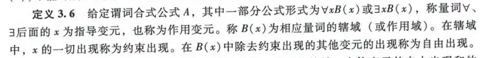

- 约束变元改名规则
  - 用于解决在合式公式中，指导变元既作为自由出现又作为约束出现的情况。例如下面：
    - 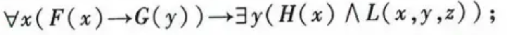

- 自由变元代入规则

##### 谓词公式的等价式与蕴涵式

- 等价式1

  - 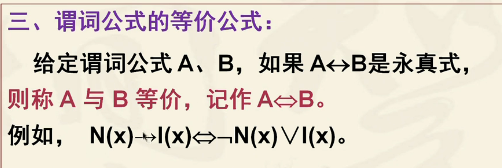

- 蕴涵式1

  - 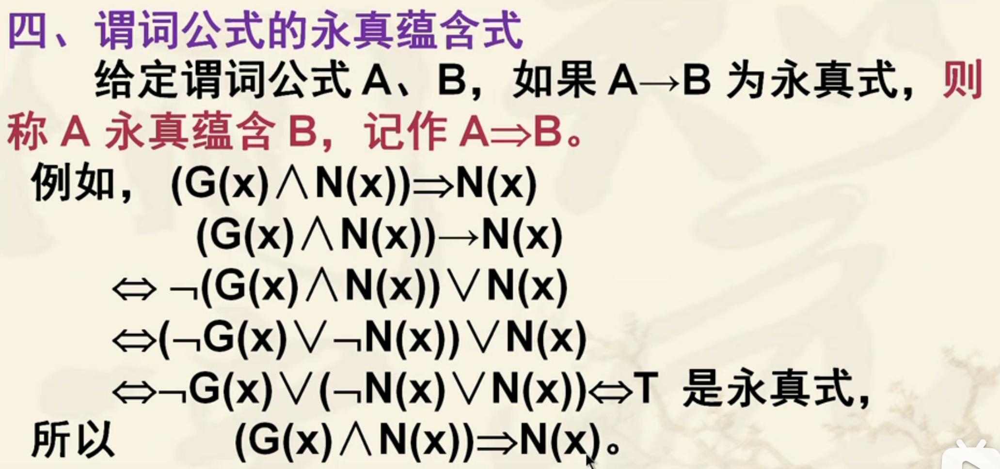

- 等价式2

  - 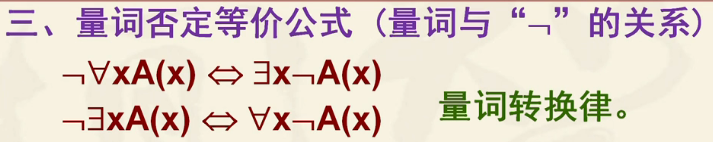

  - 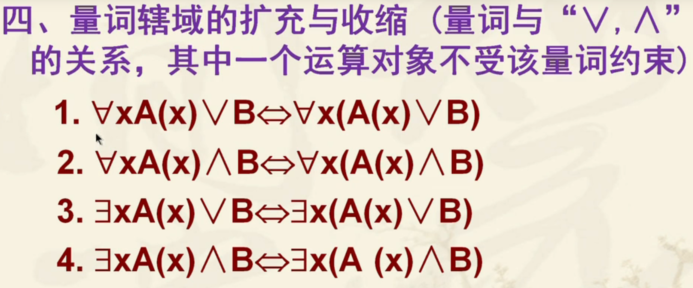

  - 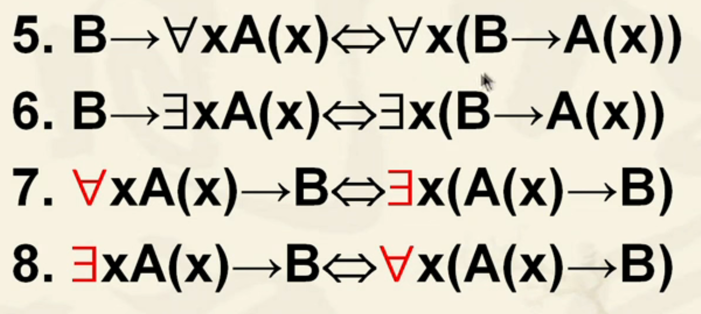

    - 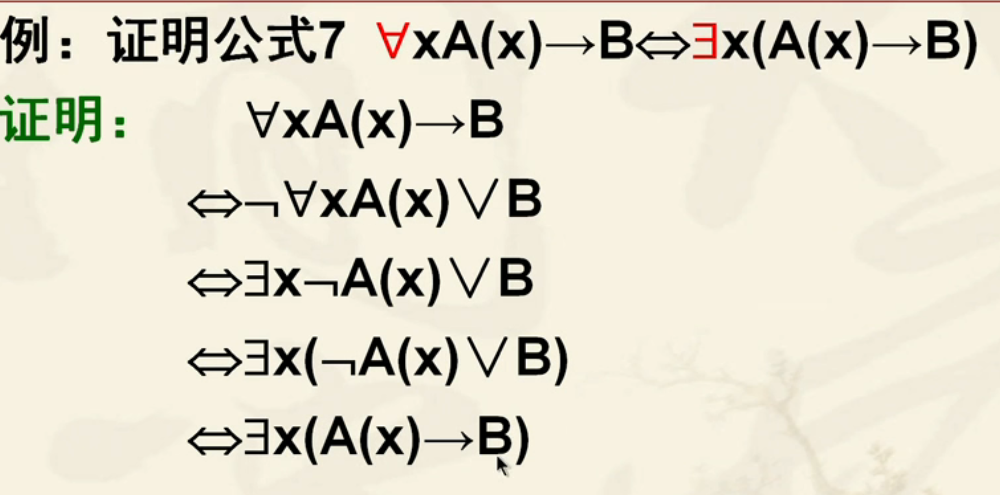

  - 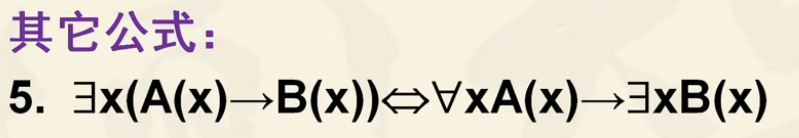

##### 前束范式

- 前束范式的概念

- 任意一个谓词公式都存在与之等值的前束范式

- 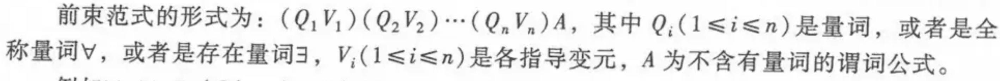

- 约束变元的换名
  
  - 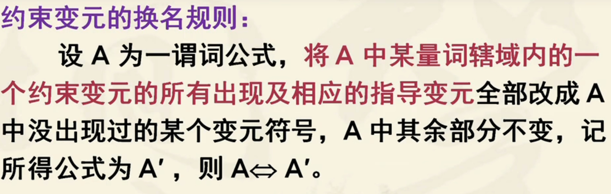 
  
  - 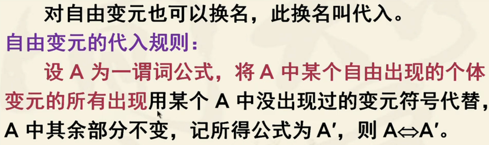 
##### 谓词演算的推理

- 全称量词消去规则

- 全称量词引入规则（不建议使用）

- 存在量词消去
  - 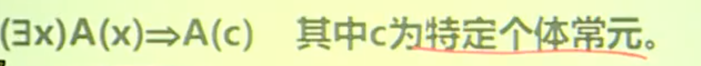

- 存在量词引入

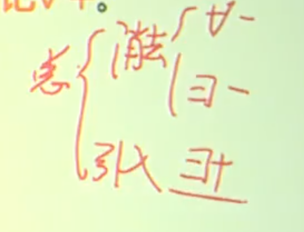

- 建议推理顺序：存在量词消去后再消去全称量词。
