#### 关系

##### 关系的表示

  - [关系的表示](https://blog.csdn.net/qq_43309907/article/details/105086584)

##### 关系矩阵的交运算：

...

##### 关系矩阵的并运算：

...

##### 关系矩阵的积运算（布尔乘）：

  - 

    - 解释：
      ```
      1、第一个矩阵中第一行的各元素与第二个矩阵中第一列的各元素对应之积的和，作为乘积矩阵的第一行第一列元素；

      2、第一个矩阵中第一行的各元素与第二个矩阵中第二列的各元素对应之积的和，作为乘积矩阵的第一行第二列元素；

      3、第一个矩阵中第一行的各元素与第二个矩阵中第三列的各元素对应之积的和，作为乘积矩阵的第一行第三列元素；

      4、第一个矩阵中第二行的各元素与第二个矩阵中第一列的各元素对应之积的和，作为乘积矩阵的第二行第一列元素；

      5、第一个矩阵中第二行的各元素与第二个矩阵中第二列的各元素对应之积的和，作为乘积矩阵的第二行第二列元素；

      6、第一个矩阵中第二行的各元素与第二个矩阵中第三列的各元素对应之积的和，作为乘积矩阵的第二行第三列元素；

      7、第一个矩阵中第三行的各元素与第二个矩阵中第一列的各元素对应之积的和，作为乘积矩阵的第三行第一列元素；

      8、第一个矩阵中第三行的各元素与第二个矩阵中第二列的各元素对应之积的和，作为乘积矩阵的第三行第二列元素；

      9、第一个矩阵中第三行的各元素与第二个矩阵中第三列的各元素对应之积的和，作为乘积矩阵的第三行第三列元素
      ```


##### 关系特有的运算：

  - 关系的复合运算

    - [关系的复合运算](https://blog.csdn.net/qq_43309907/article/details/105087134)

  - 关系的逆

  - 关系的幂

##### 关系的性质与关系运算


  - 常见的关系的性质：

    - 反自反
      - 

  - 常见关系的性质

    - 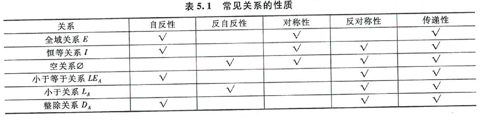


  - 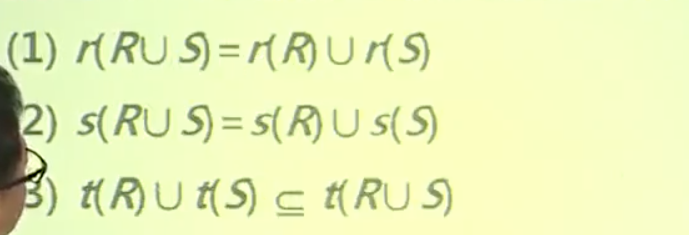
    
  - 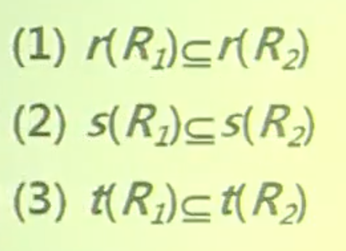
    

  - 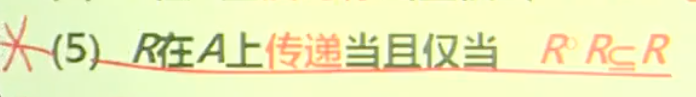


  - 
    
  - 
    

  - 

  - 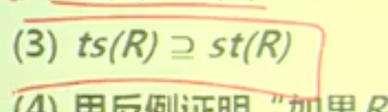


##### 等价关系与序关系

- 等价关系

  - 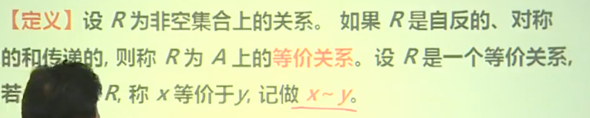

    - 技巧：1、给定划分，确定等价关系的题：

  - 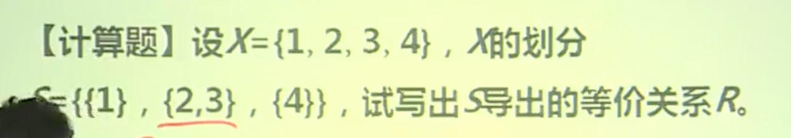

  - 2、给定等价关系，求划分

    - 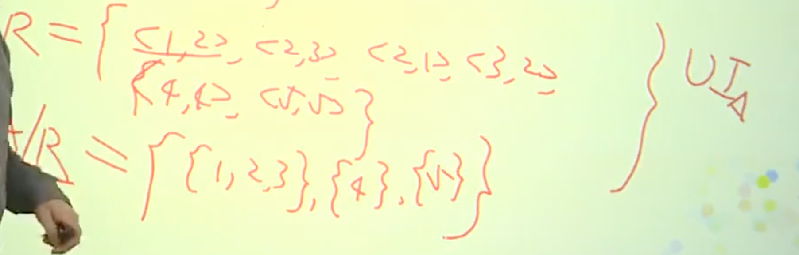

  - 3、n个元素的集合上的等价关系有多少个？

    - 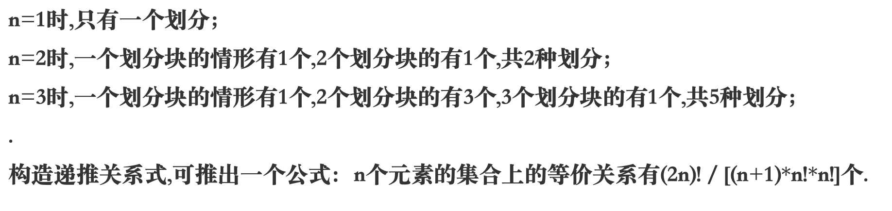

- 序关系

  - 偏序关系
  
    - 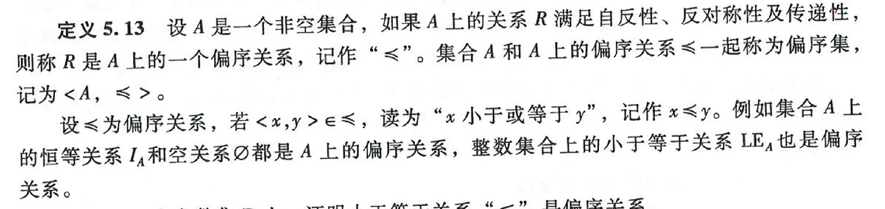

  - 偏序集与哈斯图

    - 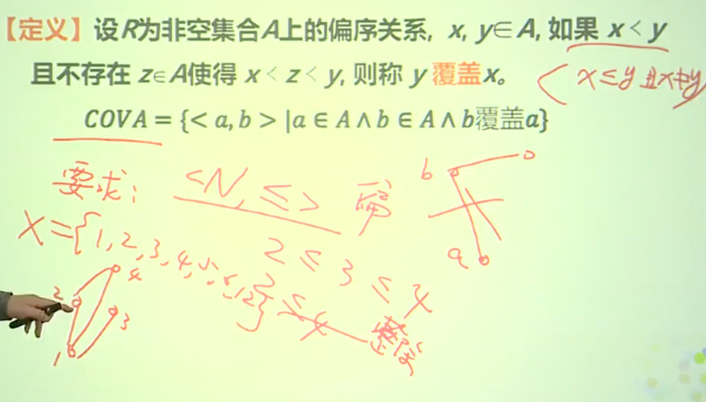

    - 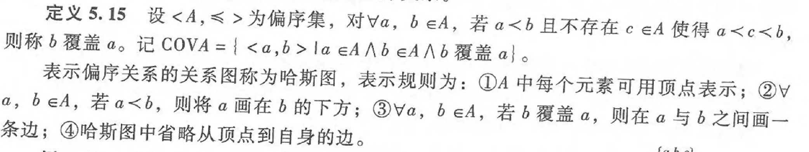

  - 最大元最小元

    - 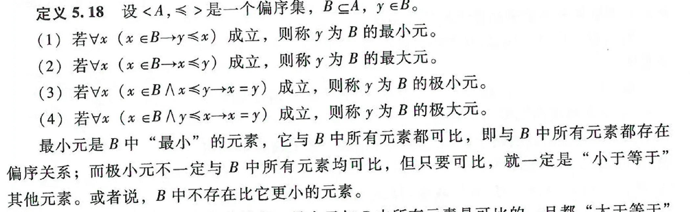

  - 


- 哈斯图画法： 简书收藏

##### 函数

- 定义

  - 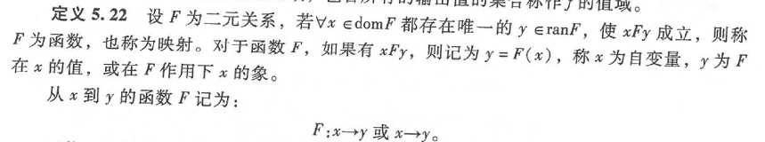

  - > 若对应所有的x属于F这个二元关系的定义域，都有唯一的y属于F这个二元关系的值域，使得xFy成立。

- 函数相等

  - 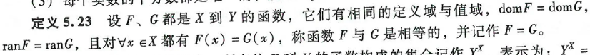

- Y上于X（X到Y的所有函数构成的集合）

  - 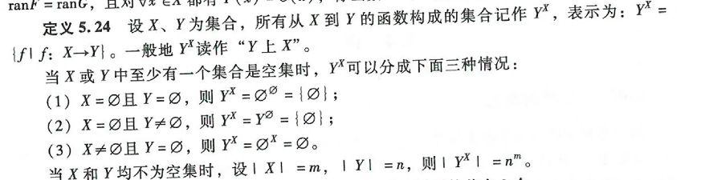

  - 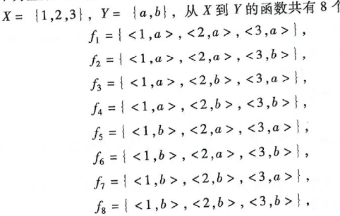

- 单射（入射）

  - 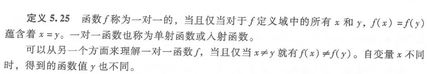

  - 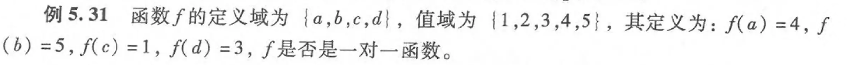

    - 是单射

- 满射（映上）

  - 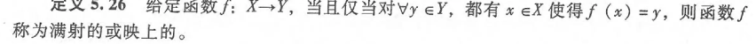

  - 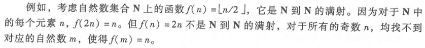

- 双射

  - 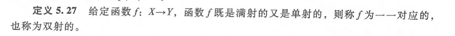

- 举例

  - 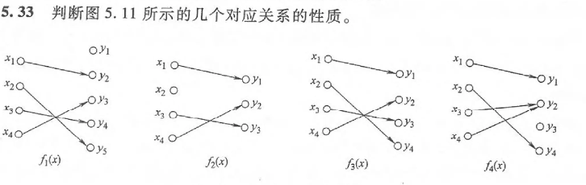

    - f1x为单射但非满射
      
    - f2x不为函数

    - f3x为单射（—对一函数）

    - f4x都不是

- 反函数

  - 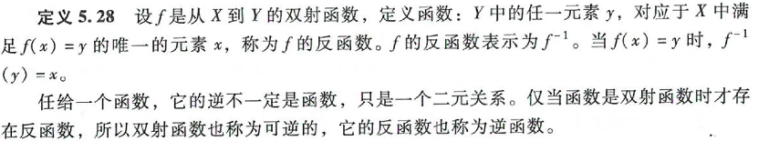

  - 判断f1和f2的性质，若是双射则求其反函数
