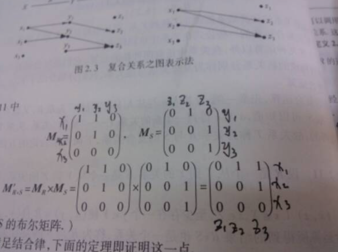

#### 关系

##### 关系的表示

  - [关系的表示](https://blog.csdn.net/qq_43309907/article/details/105086584)

##### 关系矩阵的交运算：

...

##### 关系矩阵的并运算：

...

##### 关系矩阵的积运算（布尔乘）：

  - 

    - 解释：
      ```
      1、第一个矩阵中第一行的各元素与第二个矩阵中第一列的各元素对应之积的和，作为乘积矩阵的第一行第一列元素；

      2、第一个矩阵中第一行的各元素与第二个矩阵中第二列的各元素对应之积的和，作为乘积矩阵的第一行第二列元素；

      3、第一个矩阵中第一行的各元素与第二个矩阵中第三列的各元素对应之积的和，作为乘积矩阵的第一行第三列元素；

      4、第一个矩阵中第二行的各元素与第二个矩阵中第一列的各元素对应之积的和，作为乘积矩阵的第二行第一列元素；

      5、第一个矩阵中第二行的各元素与第二个矩阵中第二列的各元素对应之积的和，作为乘积矩阵的第二行第二列元素；

      6、第一个矩阵中第二行的各元素与第二个矩阵中第三列的各元素对应之积的和，作为乘积矩阵的第二行第三列元素；

      7、第一个矩阵中第三行的各元素与第二个矩阵中第一列的各元素对应之积的和，作为乘积矩阵的第三行第一列元素；

      8、第一个矩阵中第三行的各元素与第二个矩阵中第二列的各元素对应之积的和，作为乘积矩阵的第三行第二列元素；

      9、第一个矩阵中第三行的各元素与第二个矩阵中第三列的各元素对应之积的和，作为乘积矩阵的第三行第三列元素
      ```


##### 关系特有的运算：

  - 关系的复合运算

    - [关系的复合运算](https://blog.csdn.net/qq_43309907/article/details/105087134)

  - 关系的逆

  - 关系的幂


